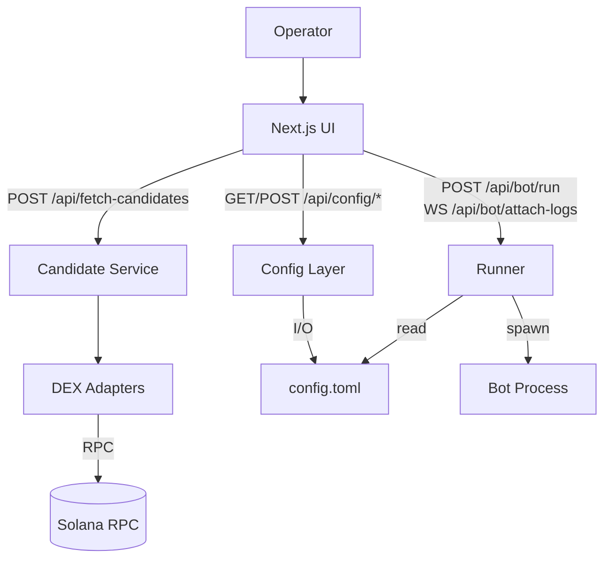

# SMB-UI

## Executive Summary
- Next.js 14 + TypeScript console for operating the Solana MEV bot without background jobs.
- Token discovery runs only on demand and aggregates DEX adapters behind a retry-aware service.
- TOML configuration is edited atomically inside a managed block with validation, diff, backup, and locking.
- Runner assembles a whitelisted CLI command, spawns the bot without a shell, and streams logs over WebSocket.
- Routing is SOL-centric: WSOL is always the base asset and the stable-mode (USDC/USD1/NONE) is read-only.
- ALT operations and extra flags are sanitized and validated before any process can start.

_Русская версия документа доступна в [README_ru.md](README_ru.md)._ 

## Table of Contents
- [1. What It Is and Who Needs It](#1-what-it-is-and-who-needs-it)
- [2. Quick Start (TL;DR)](#2-quick-start-tldr)
- [3. Environment Variables](#3-environment-variables)
- [4. Architecture and Data Flows](#4-architecture-and-data-flows)
- [5. Token Picker Screen](#5-token-picker-screen)
- [6. Config Screen](#6-config-screen)
- [7. Run & Logs Screen](#7-run--logs-screen)
- [8. Parser CLI](#8-parser-cli)
- [9. Retry Policy and Errors](#9-retry-policy-and-errors)
- [10. Security](#10-security)
- [11. Testing and CI](#11-testing-and-ci)
- [12. Limitations and Roadmap](#12-limitations-and-roadmap)
- [13. License and Contacts](#13-license-and-contacts)
- [Glossary](#glossary)

## 1. What It Is and Who Needs It
`smb-ui` is a local Next.js interface for the operator of a Solana MEV bot. It lets you manually screen candidate tokens, manage the bot configuration, and control process execution without exposing private keys.

Three pillars:
1. **Token picker** – a single form with filters and a manual “Refresh data” button to grab a fresh liquidity snapshot.
2. **TOML config management** – only the block between markers is editable, every write goes through validation, diff, and backup.
3. **Run/logs console** – a safe runner assembles a whitelisted CLI command, starts the process, and streams status plus logs into the UI.

Key principles:
- The parser is decoupled from the bot process and never schedules background work—data refresh happens **only** on button press.
- Routing is SOL-first: the parser always works with WSOL pairs and only one read-only stable-mode (USDC/USD1/NONE).
- ALT operations map to CLI flags controlled by checkboxes; dry-run mode disables ALT flags automatically.
- The managed TOML block is written atomically: lock file → temp file → rename → backup → diff.

## 2. Quick Start (TL;DR)
Requirements:
- Node.js 18.18+ (LTS) with npm 9+.
- Access to a Solana RPC endpoint (a public HTTPS endpoint works).
- Path to the bot TOML config file with tradeable token definitions (mints + pools). Stable-mode is set via env or the
  unmanaged TOML block.

Project commands:
```bash
npm ci
npm run lint
./node_modules/.bin/tsc --noEmit
npm run build
npm run dev
```

Useful URLs:
- `http://localhost:3000/token-picker`
- `http://localhost:3000/config`
- `http://localhost:3000/run`

## 3. Environment Variables
| Variable | Default / Example | Description |
| --- | --- | --- |
| `BOT_CMD` | `/usr/local/bin/smb-bot` | Absolute path to the bot executable (required by the runner). |
| `BOT_WORKDIR` | `/var/lib/smb-bot` | Working directory for the bot process (optional). |
| `BOT_CONFIG_PATH` | `/abs/path/to/config.toml` | Absolute path to the TOML config used by the parser, config screen, and runner. |
| `RPC_ENDPOINT` | `https://api.mainnet-beta.solana.com` | Primary RPC endpoint for the bot; used as a fallback by the parser. |
| `PARSER_RPC_ENDPOINT` | `https://api.mainnet-beta.solana.com` | RPC endpoint used by adapters when fetching candidates; defaults to `RPC_ENDPOINT`. |
| `STABLE_MODE` | `NONE` | Forces the SOL↔stable routing leg. Valid values: `USDC`, `USD1`, `NONE`. Overrides config. |
| `EXTRA_FLAGS_DEFAULT` | `""` (empty) | Extra CLI flags that the runner adds to every command after sanitization. |
| `SMB_UI_CONFIG_LOCK_TTL_MS` | `120000` | Lifetime of the config lock file (ms). Expired locks are purged automatically. |

`.env.local` example:
```env
BOT_CONFIG_PATH=/abs/path/to/config.toml
PARSER_RPC_ENDPOINT=https://api.mainnet-beta.solana.com
STABLE_MODE=USDC
SMB_UI_CONFIG_LOCK_TTL_MS=120000
```

## 4. Architecture and Data Flows
- **UI (Next.js / React)** – pages `/token-picker`, `/config`, `/run` operate in client mode and talk to API routes.
- **Candidate service** (`lib/services/fetch-candidates.ts`) – aggregates adapter responses, sorts, deduplicates, paginates, and shapes 200/503 payloads.
- **DEX adapters** (`lib/adapters/*`) – wrappers over liquidity sources with retry logic, normalized errors, and multi-DEX support.
- **Config module** (`lib/config/*`) – resolves the read-only stable-mode, parses the managed block, validates, diffs, and performs atomic writes with lock/backups.
- **Runner** (`lib/runner/*`) – validates payloads, builds commands, spawns processes without a shell, controls state/log buffers, and broadcasts via WebSocket.



## 5. Token Picker Screen
The core rule is no auto-refresh: data loads only when the operator clicks “Refresh data.” Routing is SOL-centric: adapters return only WSOL pairs, the UI always shows the fixed `TOKEN ↔ SOL` route, and a read-only stable-mode indicator (`USDC`/`USD1`/`NONE`) sourced from env/config. No gating is tied to managed token lists.

Available filters (`components/token-picker/filter-panel.tsx`, `lib/types/filter-schema.ts`):
- DEX: `pumpfun`, `raydium`, `meteora`.
- Pool type: `CPMM`, `CLMM`, `DLMM`.
- Minimum metrics: `minTVL`, `minVol5m`, `minVol1h`, `minVol24h`, `minPoolAgeMinutes`, `budget`, `maxSlippagePct`, `maxAltCost`.
- Exclusions: `blacklistMints`, `newerThanMinutesExclude`, `excludeFrozen`.
- Pagination: `page` (≥1) and `pageSize` (≤200).

Sorting and pagination:
- Defaults: `page=1`, `pageSize=50`, hard cap `pageSize=200`.
- Stable ordering: `score` ↓, then `vol1h` ↓, then `mint` ↑.
- Deduplication happens by `mint` before pagination.

Error handling:
- Partial failure → HTTP 200 with table data and a compact `errorsByDex` banner.
- Complete failure (all adapters down) → HTTP 503, red “all sources unavailable” banner, empty table, refresh button stays enabled.
- `errorsByDex` provides at most one entry per DEX with the message truncated to 200 characters.
- When `STABLE_MODE` is `USDC` or `USD1`, the service requires a WSOL↔stable pool and marks matching tokens as `triEligible` (small score bonus + “Tri-arb” badge).

`/api/fetch-candidates` examples:
```bash
curl -s -X POST http://localhost:3000/api/fetch-candidates \
  -H 'content-type: application/json' \
  -d '{"dexes":["raydium","meteora","pumpfun"],"page":1,"pageSize":50,"poolTypes":["CPMM","CLMM","DLMM"]}'
```
200 response (partial success):
```json
{
  "updatedAt": 1739900000000,
  "candidates": [
    {
      "mint": "ToKenMint1111111111111111111111111111111111",
      "pools": [{"dex":"raydium","poolId":"...","poolType":"CLMM"}],
      "tvlUsd": 12345.67,
      "vol1h": 890.12,
      "estSlippagePct": 0.42,
      "altCost": 3,
      "score": 73.4,
      "triEligible": true,
      "triStable": "USDC"
    }
  ],
  "total": 1,
  "page": 1,
  "pageSize": 50,
  "fetchedAt": "2025-02-18T10:13:20.000Z",
  "errorsByDex": [
    {"dex":"meteora","status":429,"message":"rate limited"}
  ]
}
```
503 response (all failed):
```json
{
  "updatedAt": 1739900000000,
  "errorsByDex": [
    {"dex":"raydium","status":502,"message":"upstream error"},
    {"dex":"meteora","status":429,"message":"rate limited"},
    {"dex":"pumpfun","status":503,"message":"temporarily unavailable"}
  ]
}
```

## 6. Config Screen
- The UI edits only the block between markers:
  ```toml
  # >>> SMB-UI MANAGED START
  # (do not edit manually)
  [routing.mint_config_list]
  # ...
  # <<< SMB-UI MANAGED END
  ```
- Everything outside the markers remains untouched and must be edited manually in TOML.
- Before writing, `POST /api/config/write` performs:
  1. Bot status check (`RUNNING`/`STARTING` → 409).
  2. JSON schema validation plus `validateManagedConfig` (ALT/compute checks, ≤100 mints, warnings).
  3. Diff against the current state via `diffManagedConfigs`; if the diff is `No changes`, the write is skipped.
  4. Atomic write: lock `.smb-ui-config.lock` → read → temp file → rename → backup `config.toml.bak-YYYYMMDD-HHMMSS`.
- The lock file lives for `SMB_UI_CONFIG_LOCK_TTL_MS` ms (120 000 by default). Expired locks are removed; an active lock returns HTTP 409 “config busy.”
- `/api/config/validate` and `/api/config/diff` power the UI “Dry validate” and “Diff” buttons.

## 7. Run & Logs Screen
- ALT checkboxes map to CLI flags (`--create/extend/deactivate/close-lookup-table`). Dry-run automatically resets ALT options.
- Extra flags (`extraFlags`) are sanitized:
  - Only `--kebab-case` or `--kebab-case=value` formats are allowed.
  - Up to 16 flags, each ≤64 characters, total length ≤256.
- `altAddress` and manual accounts must be valid Solana base58 (32–44 chars, decoded via `bs58`). Up to 64 unique manual accounts.
- Runner (`lib/runner/process-runner.ts`):
  - Performs synchronous preflight checks (`BOT_WORKDIR`, executable, config) before transitioning to `STARTING`.
  - Emits `STARTING` immediately after preflight; `RUNNING` is set only after the child process fires `spawn` and passes a liveness check. WebSocket clients receive a `STARTED` lifecycle event at that moment.
  - Any error before a healthy spawn transitions directly to `ERROR` without faking `RUNNING`.
  - On graceful completion the runner returns to `IDLE`; stop requests from `STARTING/RUNNING` send `SIGINT` with `SIGTERM`/`SIGKILL` fallbacks.
  - State snapshots and lifecycle events stream through `/api/bot/attach-logs`.
- UI logging writes NDJSON records to rotating files under `./logs/` (configurable via `SMB_UI_LOG_*`). Use `npm run ui:log:tail` to inspect the latest file.

## 8. Parser CLI
`scripts/parser-cli.ts` exposes a non-UI interface:

```bash
# Partial success exits with code 0
BOT_CONFIG_PATH=... ts-node scripts/parser-cli.ts --filters '{"dexes":["pumpfun"],"poolTypes":["CPMM"]}'

# Total adapter failure exits with code 2
BOT_CONFIG_PATH=... ts-node scripts/parser-cli.ts --filters '{"dexes":["raydium"],"poolTypes":["CLMM"]}'
```

Highlights:
- Partial success (at least one DEX responds) → `exit 0`; adapter errors are printed.
- Complete failure → log “All sources returned an error” and `process.exit(2)`.
- `--dry-validate` prints the `validateManagedConfig` report.
- `--write-config` diffs, validates, and writes the block; if the diff is `No changes`, it prints “no changes” and leaves the file untouched.
- The managed block payload can come from STDIN or `--managed '@/path/to/payload.json'`.

## 9. Retry Policy and Errors
- Retries cover network faults (`ECONNRESET`, `ETIMEDOUT`, etc.), HTTP 5xx, and 429 (`lib/net/retry.ts`).
- Other 4xx responses (except 429) are not retried.
- `errorsByDex` holds at most one entry per DEX with a trimmed message.

Troubleshooting:
- **429/5xx on a single DEX** – partial data loads, banner warns the operator; continue working.
- **503 (all DEX down)** – retry later or switch the RPC endpoint (`PARSER_RPC_ENDPOINT`).
- **409 while writing config** – another process holds the lock; wait or finish that update.
- **Launch sanitization error** – inspect `extraFlags`, base58 addresses, and manual account list.

## 10. Security
- Neither UI nor server stores private keys; signing lives outside `smb-ui`.
- Runner executes the process with `shell: false` and whitelisted arguments; arbitrary flags are rejected.
- Logs avoid secrets: the config path is masked (`--config ***`), buffer size is capped.

## 11. Testing and CI
Local checks:
```bash
npm run lint
./node_modules/.bin/tsc --noEmit
npm run build
```

API smoke tests:
- `POST /api/fetch-candidates` – verify 200 with `errorsByDex` (partial) and 503 (complete failure).
- `POST /api/config/validate`, `POST /api/config/diff`, `POST /api/config/write` – cover success, lock 409, and no-change branches.
- `POST /api/bot/run` (valid payload), `POST /api/bot/stop` (graceful stop), WebSocket `/api/bot/attach-logs`.

Manual UI scenarios:
1. STABLE_MODE unset or invalid → resolved to `NONE` for backend scoring; the UI focuses on the managed block only.
2. Partial adapter failure → table with data plus yellow banner.
3. Complete failure → red banner, empty table, refresh button enabled.
4. Config write with active/expired lock.
5. Runner: launch with ALT, dry-run, manual accounts, process stop.

## 12. Limitations and Roadmap
- Mock adapters are used today (`lib/adapters/mock-dex.ts`). Real integrations plug into the `DexAdapter` interface without API changes.
- Candidate table is not virtualized—consider virtual scrolling once you exceed ~300 rows.
- Score and metric extensions can be added without changing the `candidates[]` payload schema.

## 13. License and Contacts
- License: not specified (internal tool, all rights reserved).
- Contacts: Telegram [@Agropilot_UA](https://t.me/Agropilot_UA).

## Glossary
- **Stable-mode** – read-only setting (ENV or unmanaged TOML) selecting the SOL↔USDC/USD1 leg for triangular routes.
- **ALT** – Address Lookup Table operations (create/extend/deactivate/close) toggled through CLI flags.
- **Managed block** – the `config.toml` segment editable between `SMB-UI MANAGED` markers.
- **503** – API response when all candidate sources fail.
- **409** – conflict response during config writes (lock file or bot already running).
- **Partial failure** – scenario where some DEX fail but at least one returns data.

If you found this program usefull, you may make donation with some SOL ELRtjwgUqkX9dDZFdYr2SjyzJ2nB3D4GT9JXGk4rMaah
