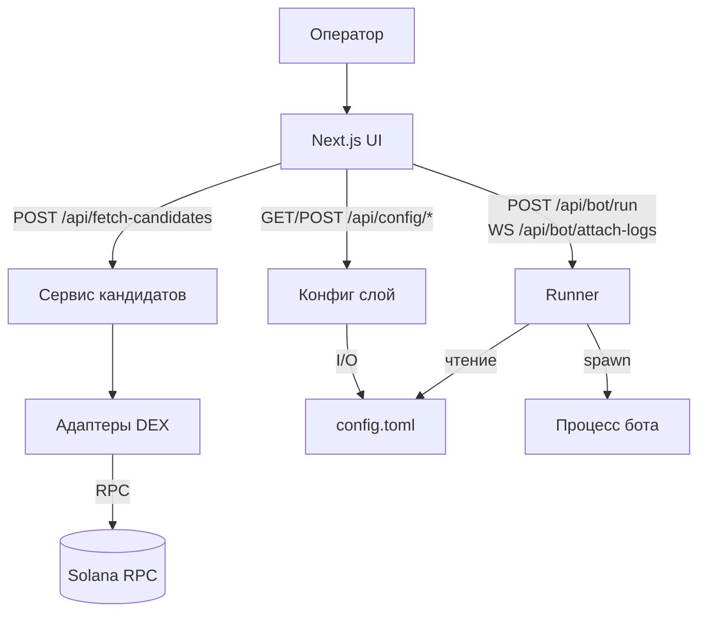

# SMB-UI

## Executive Summary
- Next.js 14 + TypeScript UI для ручного управления Solana MEV ботом без фоновых задач.
- Подбор токенов выполняется только по кнопке и агрегирует ответы DEX через единый сервис с ретраями.
- Конфиг TOML редактируется атомарно в управляемом блоке с diff, backup и dry-валидацией.
- Runner собирает whitelisted CLI-команду, запускает процесс без shell и стримит логи по WebSocket.
- Маршрут всегда через SOL: WSOL — базовый актив, read-only stable-mode (`USDC`/`USD1`/`NONE`) задаётся вне UI.
- ALT операции и дополнительные флаги проходят строгую санитизацию и валидацию перед запуском.

_English version is available in [README.md](README.md)._ 

## Оглавление
- [1. Что это и для кого](#1-что-это-и-для-кого)
- [2. Быстрый старт (TL;DR)](#2-быстрый-старт-tldr)
- [3. Переменные окружения](#3-переменные-окружения)
- [4. Архитектура и потоки](#4-архитектура-и-потоки)
- [5. Экран «Подбор токенов»](#5-экран-подбор-токенов)
- [6. Экран «Конфиг»](#6-экран-конфиг)
- [7. Экран «Запуск и логи»](#7-экран-запуск-и-логи)
- [8. Parser CLI](#8-parser-cli)
- [9. Политика ретраев и ошибки](#9-политика-ретраев-и-ошибки)
- [10. Безопасность](#10-безопасность)
- [11. Тестирование и CI](#11-тестирование-и-ci)
- [12. Ограничения и план развития](#12-ограничения-и-план-развития)
- [13. Лицензия и контакты](#13-лицензия-и-контакты)
- [Глоссарий](#глоссарий)

## 1. Что это и для кого
`smb-ui` — локальный Next.js интерфейс для оператора Solana MEV бота. Приложение помогает вручную подбирать токены, управлять конфигурацией и контролировать запуск процесса без вмешательства в приватные ключи.

Три кита:
1. **Подбор токенов** — единая форма с фильтрами и ручной кнопкой «Обновить данные» для получения свежего снимка ликвидности.
2. **Управление конфигом TOML** — редактируется только блок между маркерами, запись проходит валидацию, diff и бэкап.
3. **Запуск/логи** — безопасный раннер собирает whitelisted CLI-команду, стартует процесс, транслирует состояние и логи в UI.

Ключевые принципы:
- Парсер не зависит от процесса бота и не создает фоновых задач — данные обновляются **только** по нажатию кнопки.
- Маршрут SOL-центричный: адаптеры работают только с парами WSOL, stable-mode (`USDC`/`USD1`/`NONE`) задаётся вне UI и отображается как read-only.
- ALT-операции выбираются чекбоксами и транслируются в CLI-флаги при запуске; режим dry-run отключает ALT.
- Запись управляемого блока TOML атомарна: lock-файл → temp-файл → rename → backup → diff.

## 2. Быстрый старт (TL;DR)
Требования:
- Node.js 18.18+ (LTS) с npm 9+.
- Доступ к Solana RPC (достаточен публичный https endpoint).
- Путь к TOML-конфигу с описанием торгуемых токенов (mint + ID пулов). Stable-mode настраивается через ENV или неуправляемый блок TOML.

Команды запуска проекта:
```bash
npm ci
npm run lint
./node_modules/.bin/tsc --noEmit
npm run build
npm run dev
```

Полезные URL’ы:
- `http://localhost:3000/token-picker`
- `http://localhost:3000/config`
- `http://localhost:3000/run`

## 3. Переменные окружения
| Переменная | По умолчанию / пример | Описание |
| --- | --- | --- |
| `BOT_CMD` | `/usr/local/bin/smb-bot` | Абсолютный путь к исполняемому файлу бота (обязателен для runner). |
| `BOT_WORKDIR` | `/var/lib/smb-bot` | Рабочая директория процесса бота (опционально). |
| `BOT_CONFIG_PATH` | `/abs/path/to/config.toml` | Абсолютный путь к TOML-конфигу. Используется парсером, экраном конфига и runner. |
| `RPC_ENDPOINT` | `https://api.mainnet-beta.solana.com` | Основной RPC для бота; используется как fallback для парсера. |
| `PARSER_RPC_ENDPOINT` | `https://api.mainnet-beta.solana.com` | RPC, который используют адаптеры при подборе токенов; по умолчанию берёт `RPC_ENDPOINT`. |
| `STABLE_MODE` | `NONE` | Read-only режим SOL↔стейбл: `USDC`, `USD1` или `NONE`. Значение из ENV имеет приоритет над конфигом. |
| `EXTRA_FLAGS_DEFAULT` | `""` (пусто) | Дополнительные CLI-флаги, которые runner добавляет к каждой команде после санитизации. |
| `SMB_UI_CONFIG_LOCK_TTL_MS` | `120000` | TTL lock-файла конфигурации (мс). Просроченные lock удаляются автоматически. |

Пример `.env.local`:
```env
BOT_CONFIG_PATH=/abs/path/to/config.toml
PARSER_RPC_ENDPOINT=https://api.mainnet-beta.solana.com
STABLE_MODE=USD1
SMB_UI_CONFIG_LOCK_TTL_MS=120000
```

## 4. Архитектура и потоки
- **UI (Next.js / React)** — страницы `/token-picker`, `/config`, `/run` работают в client mode и общаются с API-роутами.
- **Сервис кандидатов** (`lib/services/fetch-candidates.ts`) — агрегирует ответы адаптеров, сортирует, дедуплицирует и пагинирует кандидатов; формирует payloadы 200/503.
- **Адаптеры DEX** (`lib/adapters/*`) — обёртки поверх источников ликвидности с retry-логикой, унифицированными ошибками и поддержкой разных DEX.
- **Конфиг** (`lib/config/*`) — определение read-only stable-mode, парсинг управляемого блока, валидация, diff, атомарная запись с lock/backups.
- **Runner** (`lib/runner/*`) — валидация payloadов, построение команд, spawn без shell, управление состоянием и буфером логов, WebSocket-раздача событий.



## 5. Экран «Подбор токенов»
Основной принцип — никаких автозапусков: данные обновляются только по кнопке «Обновить данные». Маршрут SOL-центричный: адаптеры возвращают только пары WSOL, UI постоянно показывает строку `TOKEN ↔ SOL`, а read-only stable-mode (`USDC`/`USD1`/`NONE`) берётся из ENV/конфига. Никаких гейтов по наличию списков токенов нет.

Доступные фильтры (`components/token-picker/filter-panel.tsx`, `lib/types/filter-schema.ts`):
- DEX: `pumpfun`, `raydium`, `meteora`.
- Тип пула: `CPMM`, `CLMM`, `DLMM`.
- Минимальные метрики: `minTVL`, `minVol5m`, `minVol1h`, `minVol24h`, `minPoolAgeMinutes`, `budget`, `maxSlippagePct`, `maxAltCost`.
- Исключения: `blacklistMints`, `newerThanMinutesExclude`, `excludeFrozen`.
- Пагинация: `page` (≥1) и `pageSize` (≤200).

Порядок сортировки и пагинация:
- Пагинация по умолчанию: `page=1`, `pageSize=50`, верхний предел `pageSize=200`.
- Сортировка стабильная: `score` ↓, затем `vol1h` ↓, затем `mint` ↑.
- Дедупликация по `mint` до пагинации.

Обработка ошибок источников:
- Частичный сбой → HTTP 200, таблица данных + компактный баннер с `errorsByDex`.
- Полный сбой (все адаптеры упали) → HTTP 503, красный баннер «Все источники недоступны», таблица пустая, кнопка «Обновить» активна (можно пробовать снова).
- `errorsByDex` содержит максимум одну запись на DEX, сообщение обрезано до 200 символов.
- Если `STABLE_MODE` = `USDC` или `USD1`, сервис проверяет наличие пула WSOL↔стейбл и помечает подходящие токены `triEligible` (плюс маленький бонус к score и бейдж «Tri-arb»).

Примеры `curl` к `/api/fetch-candidates`:
```bash
curl -s -X POST http://localhost:3000/api/fetch-candidates \
  -H 'content-type: application/json' \
  -d '{"dexes":["raydium","meteora","pumpfun"],"page":1,"pageSize":50,"poolTypes":["CPMM","CLMM","DLMM"]}'
```
Ответ 200 (частичный успех):
```json
{
  "updatedAt": 1739900000000,
  "stableMode": "USDC",
  "stableMint": "EPjFWdd5AufqSSqeM2qZzEwG7NDT8f9n9whscWUG5t9",
  "candidates": [
    {
      "mint": "ToKenMint1111111111111111111111111111111111",
      "pools": [{"dex":"raydium","poolId":"...","poolType":"CLMM"}],
      "tvlUsd": 12345.67,
      "vol1h": 890.12,
      "estSlippagePct": 0.42,
      "altCost": 3,
      "score": 73.4,
      "triEligible": true,
      "triStable": "USDC"
    }
  ],
  "total": 1,
  "page": 1,
  "pageSize": 50,
  "fetchedAt": "2025-02-18T10:13:20.000Z",
  "baseTokens": [],
  "anchorTokens": [],
  "errorsByDex": [
    {"dex":"meteora","status":429,"message":"rate limited"}
  ]
}
```
Полный фейл (HTTP 503):
```json
{
  "updatedAt": 1739900000000,
  "stableMode": "NONE",
  "errorsByDex": [
    {"dex":"raydium","status":502,"message":"upstream error"},
    {"dex":"meteora","status":429,"message":"rate limited"},
    {"dex":"pumpfun","status":503,"message":"temporarily unavailable"}
  ]
}
```

## 6. Экран «Конфиг»
- UI редактирует только блок между маркерами:
  ```toml
  # >>> SMB-UI MANAGED START
  # (не редактируйте вручную)
  [routing.mint_config_list]
  # ...
  # <<< SMB-UI MANAGED END
  ```
- Stable-mode отображается отдельным read-only блоком; торгуемые токены по-прежнему правятся вручную в TOML.
- Перед записью `POST /api/config/write` выполняет:
  1. Проверку статуса бота (`RUNNING`/`STARTING` → 409).
  2. JSON-schema валидацию + `validateManagedConfig` (ALT/compute оценки, лимит 100 mint, предупреждения).
  3. Сравнение с текущим состоянием через `diffManagedConfigs`; если diff `No changes`, запись пропускается.
  4. Атомарную запись: lock `.smb-ui-config.lock` → чтение → temp → rename → backup `config.toml.bak-YYYYMMDD-HHMMSS`.
- Lock-файл живёт `SMB_UI_CONFIG_LOCK_TTL_MS` мс (120 000 по умолчанию). Просроченные lock удаляются; активный lock возвращает HTTP 409 «конфиг занят».
- Ответы `/api/config/validate` и `/api/config/diff` доступны из UI-кнопок «Dry-валидация» и «Diff».

## 7. Экран «Запуск и логи»
- ALT чекбоксы → CLI-флаги (`--create/extend/deactivate/close-lookup-table`). При включённом dry-run ALT автоматически сбрасываются.
- Дополнительные флаги (`extraFlags`) проходят санитизацию:
  - Разрешены только `--kebab-case` либо `--kebab-case=value`.
  - Максимум 16 флагов, каждый ≤64 символов, суммарно ≤256.
- `altAddress` и manual accounts валидируются как Solana base58 (32–44 символа, декодируются `bs58`). До 64 уникальных manual accounts.
- Runner (`lib/runner/process-runner.ts`):
  - Проверяет, что конфиг не залочен (`ensureConfigLockNotPresent`).
  - Строит команду через `buildRunCommand`, добавляя `--config <path>` и sanitised `EXTRA_FLAGS_DEFAULT`.
  - Запускает процесс `spawn(cmd, args, { shell: false })`; stdout/stderr режутся до 8192 символов, хранится буфер ≤2000 строк.
  - Состояния: `IDLE → STARTING → RUNNING → STOPPED/ERROR`; статус доступен по `GET /api/bot/status` и WebSocket `/api/bot/attach-logs`.
  - `POST /api/bot/stop` отправляет `SIGINT`, затем `SIGTERM` через 5 c, `SIGKILL` через 10 c при необходимости.

## 8. Parser CLI
`scripts/parser-cli.ts` предоставляет интерфейс без UI:

```bash
# Успешный прогон с partial success → exit 0
BOT_CONFIG_PATH=... ts-node scripts/parser-cli.ts --filters '{"dexes":["pumpfun"],"poolTypes":["CPMM"]}'

# Полный провал всех DEX → exit 2
BOT_CONFIG_PATH=... ts-node scripts/parser-cli.ts --filters '{"dexes":["raydium"],"poolTypes":["CLMM"]}'
```

Особенности:
- Частичный успех (один DEX ответил) → `exit 0`, ошибки источников печатаются.
- Полный фейл → лог «Все источники вернули ошибку» и `process.exit(2)`.
- `--dry-validate` печатает отчёт `validateManagedConfig`.
- `--write-config` создаёт diff, валидирует и записывает блок; если diff `No changes`, выводит «изменений нет» и не трогает файл.
- Payload управляемого блока можно передать через STDIN или `--managed '@/path/to/payload.json'`.

## 9. Политика ретраев и ошибки
- Ретраи выполняются для сетевых ошибок (`ECONNRESET`, `ETIMEDOUT`, etc.), HTTP 5xx и 429 (`lib/net/retry.ts`).
- 4xx (кроме 429) не ретраятся.
- `errorsByDex` содержит максимум одну запись на DEX с укороченным сообщением.

Типичные ошибки и решения:
- **429/5xx на одном DEX** — данные частичные, баннер предупреждает. Можно продолжать работу.
- **503 (все DEX упали)** — повторить позже или сменить RPC (`PARSER_RPC_ENDPOINT`).
- **409 при записи конфига** — другой процесс держит lock. Подождите или завершите обновление.
- **Ошибка санитизации запуска** — проверить `extraFlags`, base58 адреса и режим manual accounts.

## 10. Безопасность
- UI/сервер не хранят приватные ключи. Подпись транзакций происходит вне `smb-ui`.
- Runner запускает процесс с `shell: false` и whitelisted аргументами; произвольные флаги отклоняются.
- Логи не содержат секретов: путь к конфигу маскируется (`--config ***`), буфер ограничен.

## 11. Тестирование и CI
Локальные проверки:
```bash
npm run lint
./node_modules/.bin/tsc --noEmit
npm run build
```

Смоки API:
- `POST /api/fetch-candidates` → ждать 200 с `errorsByDex` (частичный) и 503 (полный).
- `POST /api/config/validate`, `POST /api/config/diff`, `POST /api/config/write` (success / lock 409 / no changes).
- `POST /api/bot/run` (валидный payload), `POST /api/bot/stop` (остановка), WebSocket `/api/bot/attach-logs`.

Ручные сценарии UI:
1. STABLE_MODE не задан или некорректен → трактуется как `NONE`, отображается как read-only статус.
2. Частичный фейл адаптера → таблица с данными + жёлтый баннер.
3. Полный фейл → красный баннер, таблица пустая, кнопка активна.
4. Запись TOML при активном/просроченном lock.
5. Runner: запуск с ALT, dry-run, manual accounts, остановка процесса.

## 12. Ограничения и план развития
- Сейчас используются mock-адаптеры (`lib/adapters/mock-dex.ts`). Подключение реальных источников требует имплементации интерфейса `DexAdapter`, но не ломает API.
- Таблица кандидатов не виртуализирована — при >300 строк рекомендуется добавить virtual scroll.
- Расширение метрик и скорингов возможны без изменения протокола `candidates[]`.

## 13. Лицензия и контакты
- Лицензия: не указана (внутренний инструмент, все права защищены).
- Контакты: Telegram [@Agropilot_UA](https://t.me/Agropilot_UA).

## Глоссарий
- **Stable-mode** — read-only настройка (ENV или неуправляемый блок TOML), выбирающая SOL↔USDC/USD1 плечо для треугольного маршрута.
- **ALT** — Address Lookup Table операции (create/extend/deactivate/close), включаются флагами CLI.
- **Managed block** — участок `config.toml`, который UI может изменять между маркерами `SMB-UI MANAGED`.
- **503** — ответ API «Все источники недоступны» при подборе кандидатов.
- **409** — конфликт при записи конфига (lock-файл или запуск бота).
- **Partial failure** — ситуация, когда часть DEX ответила ошибкой, но хотя бы один вернул данные.

Если это приложение оказалось полезным, то можно отблагодарить донатом на сол кошелёк ELRtjwgUqkX9dDZFdYr2SjyzJ2nB3D4GT9JXGk4rMaah
